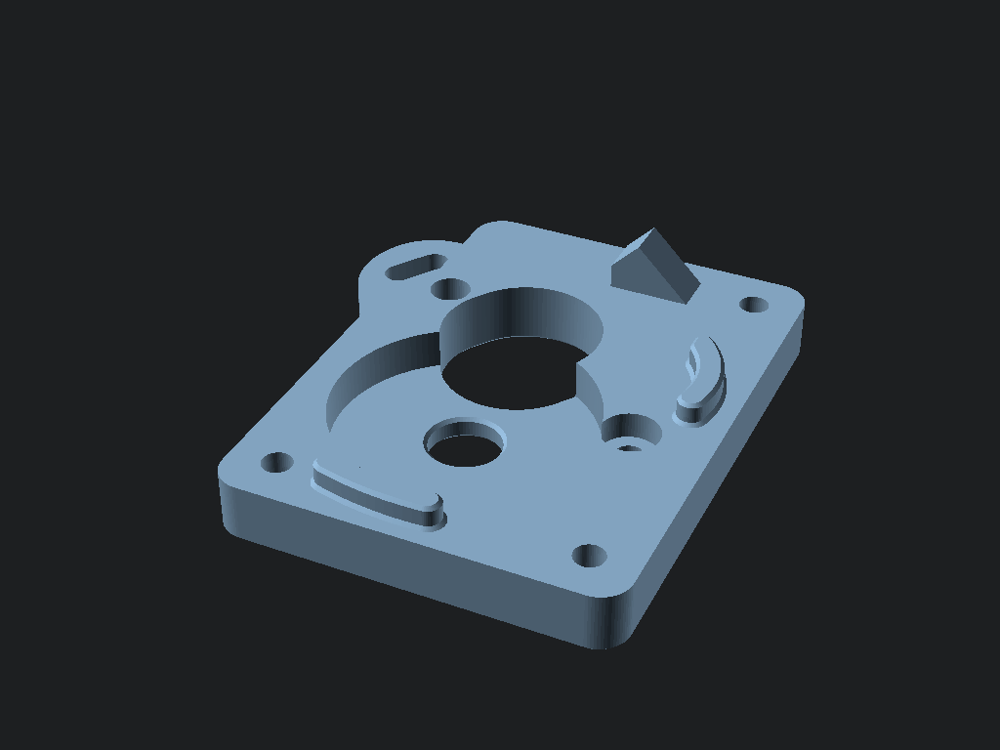
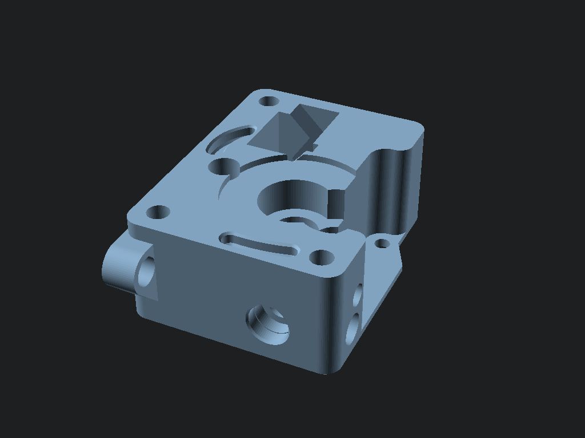
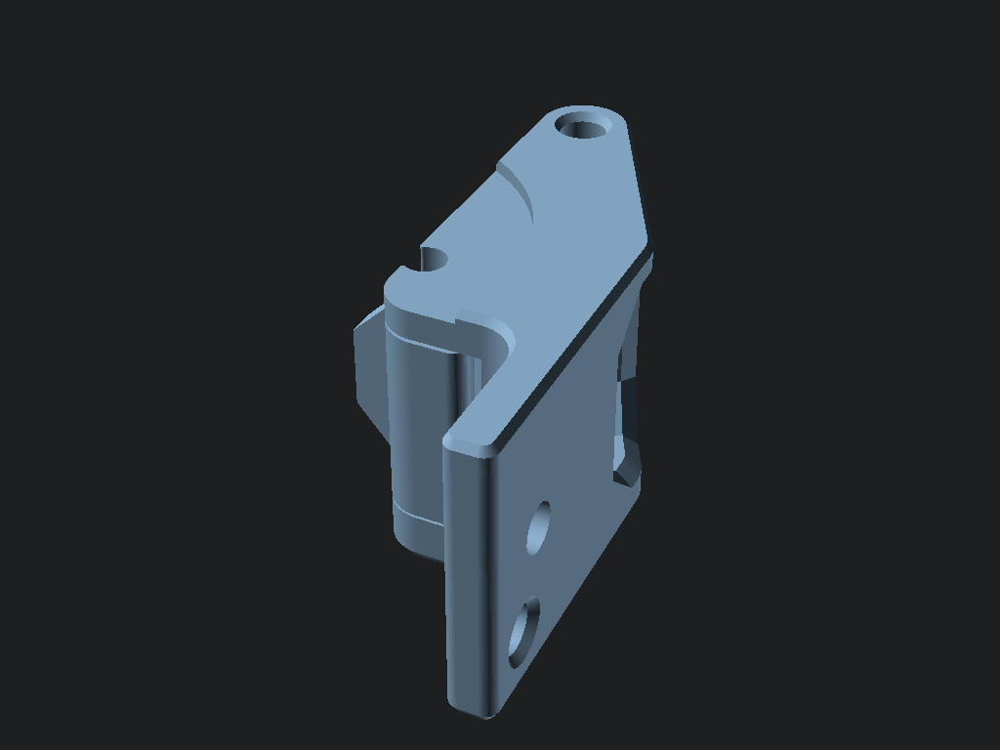
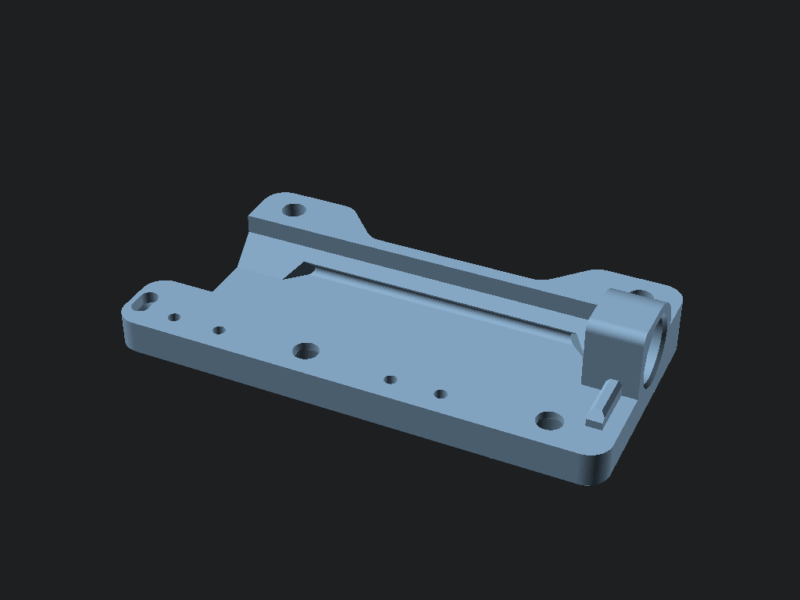
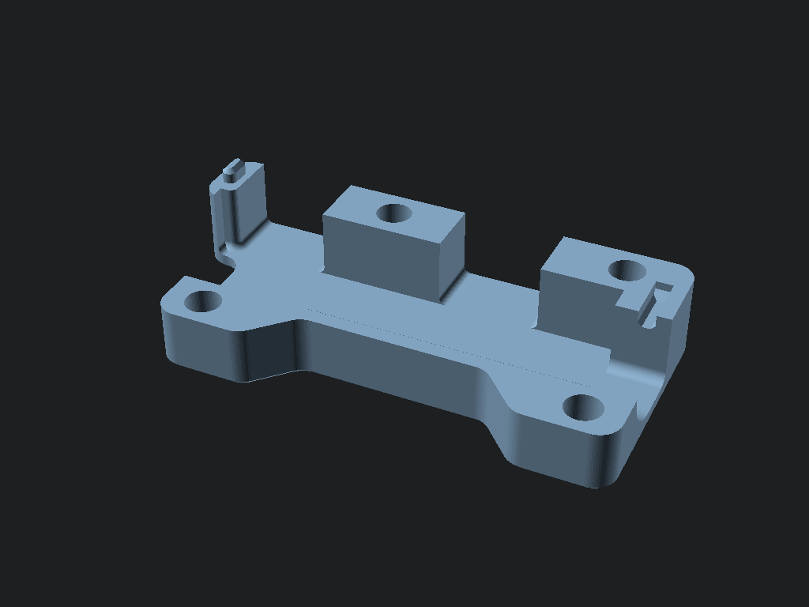

# Hardware Assembly Guide

This guide covers the assembly of the Box Turtle feeder system.

## Phase 1: Printed Parts Preparation

Before starting assembly, ensure you have all the required printed parts.

### 1. Extruder Modules (x4)
Each of the 4 lanes requires an extruder module.
*   **Motor Plate**: Mounts the NEMA 14 motor.
    
*   **Housing**: Main body of the extruder.
    
*   **Guidler**: The idler arm for the filament gear.
    

### 2. TurtleNeck (Buffer)
The input buffer system.
*   **Frame**: The main structural element.
    
*   **Lid**: Covers the buffer mechanism.
    
*   **Slide**: The moving shuttle.
    

### 3. Electronics Mount
*   **Shield Mount**: Custom mount for the PCB.
    

---

## Phase 2: Extruder Assembly

**Tools Required:**
*   Hex Drivers (1.5mm, 2.0mm, 2.5mm)
*   Superglue (for magnets)

**Steps:**
1.  **Motor Installation**: Secure the NEMA 14 motor to the `Motor Plate` using 2x M3x6mm screws.
2.  **Gear Assembly**: Install the BMG drive gears onto the motor shaft. Align the grub screw with the flat spot.
3.  **Housing Merge**: Attach the `Housing` to the `Motor Plate`.
4.  **Idler Tension**: Insert the `Guidler` into the housing and secure with the M3 screw and spring.

---

## Phase 3: TurtleNeck Assembly

1.  **Insert Magnets**: Press fit the 6x3mm magnets into the `Slide` and `Frame`. **Check Polarity!** They must repel the slide to the "home" position.
2.  **Sensor Install**: Snap the Omron D2HW switch into the `Frame` sensor slot.
3.  **Close Up**: Place the `Lid` over the assembly and secure with M3 screws.

---

## Phase 4: Electronics & Wiring

### PCB Setup
1.  **Solder Components**: Follow the [Electronics Design Guide](electronics_design.md) and [Bill of Materials](bom.md) to populate your Shield v2.
2.  **Mounting**: Screw the PCB into the `Shield Mount` printed part.

### Wiring Harness
*   **Motors**: Connect the 4 extruders to ports L1, L2, L3, L4.
*   **Sensors**: Connect the TurtleNeck sensors to S1, S2, S3, S4.

> **Note**: Ensure the Buck Converter is set to 5.1V *before* connecting the Pico!

[Next: Firmware Setup](firmware_setup.md)
