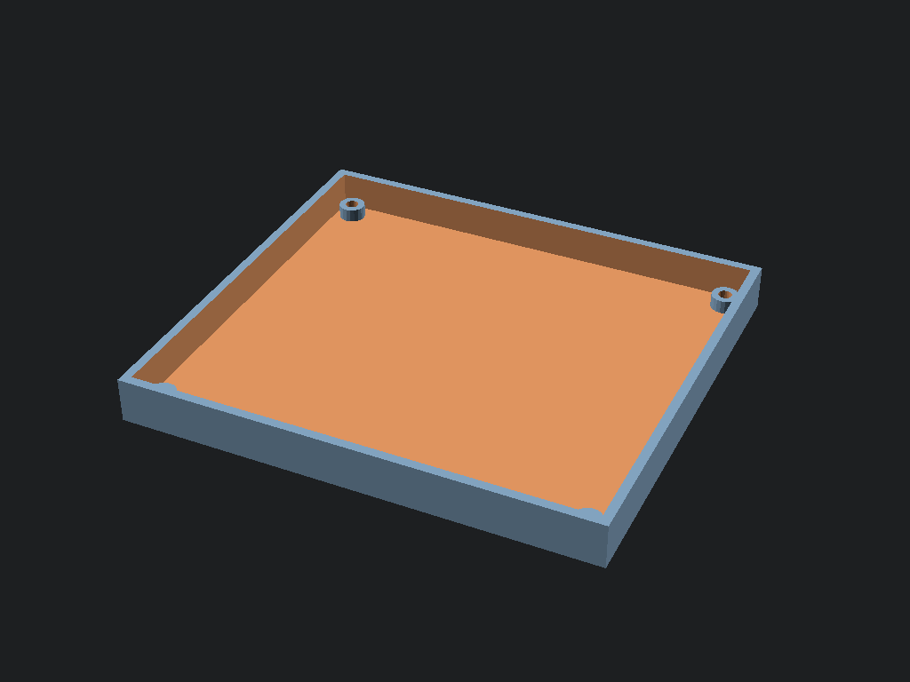

# Hardware Assembly Guide

## Part 1: 3D Printing

### Required Parts
Navigate to the `STLs/Base_Build` directory in the repository. You will need to print:

*   **4x Extruder Bodies**: `Extruder/` (Choose the version for NEMA 14).
*   **4x Idler Assemblies**: `Idlers/`.
*   **1x TurtleNeck**: `TurtleNeck/` (The input buffer).
*   **1x Shield Mount**: Generate this from `CAD/Shield_Mount.scad` using OpenSCAD.

**Print Settings:**
*   Material: ABS or ASA (Recommended), PETG (Acceptable).
*   Infill: 40% Grid/Cubic.
*   Walls: 4 perimeters.

---

## Part 2: Electronics (Pico Shield v2)

We use a custom "Shield" to connect the Raspberry Pi Pico to the motors and sensors.

### Bill of Materials (BOM)
*   **1x** Raspberry Pi Pico (or Pico W for Extended).
*   **4x** Stepper Drivers (TMC2209 or A4988).
*   **4x** 100µF Electrolytic Capacitors (Critical!).
*   **1x** Buck Converter (24V -> 5V).
*   **Connectors**: JST-XH (4-pin for motors, 3-pin for sensors).

*(See full BOM in `BT_Wiring/BOM_Shopping_List.md`)*

### Assembly Steps

1.  **PCB Fabrication**:
    *   Use the Fritzing file `BT_Wiring/BoxTurtle_Shield_Basic.fz` (or `Extended.fz`) to export Gerbers and order a PCB, OR use a 100x80mm prototype board.
    
    > ![Placeholder: Image of bare PCB or Prototype Board layout]

2.  **Soldering**:
    *   **Headers**: Solder female headers for the Pico and Stepper Drivers.
    *   **Capacitors**: Solder the 100µF capacitors near the driver power pins. **Watch Polarity!** (Stripe is Negative).
    *   **Power**: Solder the Screw Terminal for 24V input.
    *   **Buck Converter**: Solder the 5V regulator.

    > ![Placeholder: Image of soldered board with components labeled]

3.  **Wiring**:
    *   **Motors**: Connect NEMA 14 motors to the 4-pin headers (L1-L4).
    *   **Sensors**: Connect Omron D2HW switches to the 3-pin headers (S1-S4).
    *   **Servo**: Connect the Cutter Servo to the Servo header.

    > ![Placeholder: Wiring Diagram from Fritzing]

---

## Part 3: Final Assembly

1.  Mount the PCB into the printed **Shield Mount**.
    
    

2.  Secure the mount to your printer frame (e.g., DIN rail or extrusion).
3.  Connect the 24V Power Supply (Ensure printer is OFF!).
4.  Connect the USB cable from the Pico to your Klipper Host (Raspberry Pi).
